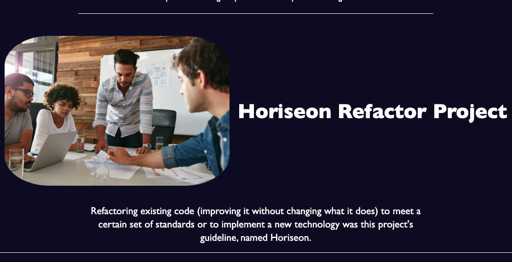
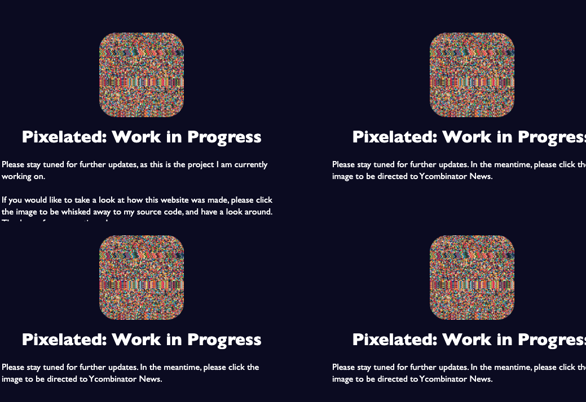

# Depixelate: J Shienbaum Portfolio

## Description

This website contains a personal portfolio of work. While this website is a work in progress, the first groupings are going to be created from a bootcamp, with later apps and websites to be created as required.

## Screenshots

## Usage

Please peruse the webpage at your leisure, please follow the link below

* [GitHub Repository](https://github.com/DigitallyIntrinsic/depixelated-a-portfolio)
* [Deployed GitHub Application](https://digitallyintrinsic.github.io/depixelated-a-portfolio/)

## See something that could be better?

If you notice anything that can be made better, please do not hesitate to let me know!

## License

This is created under the MIT License convention.

---

