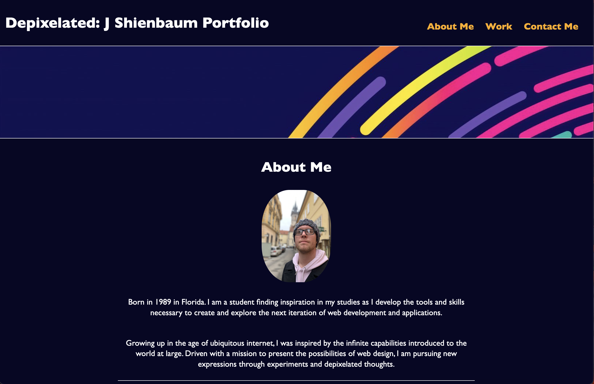

# Depixelate: J Shienbaum Portfolio

## Description

Please allow me to introduce digital self through these various applications and coding repositories you will find on this website.
Feel free to explore, comment, create, or contribute to any of these projects, there is no such thing as perfect code and together 
we can all help make our projects better as a community. 
If you have any questions, please feel free to send me an email. 
Thank you!

## Usage

Please peruse the webpage at your leisure, please follow the link below

* [GitHub Repository](https://github.com/DigitallyIntrinsic/depixelated-a-portfolio)
* [Deployed GitHub IO](https://digitallyintrinsic.github.io/depixelated-a-portfolio/)

## See something that could be better?

If you notice anything that can be made better, please do not hesitate to let me know!

## License

This is created under the MIT License convention.

---

